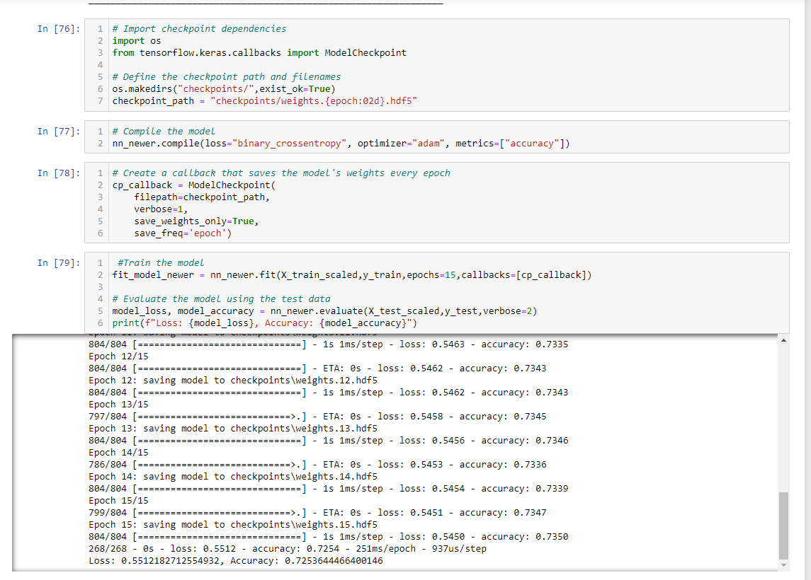
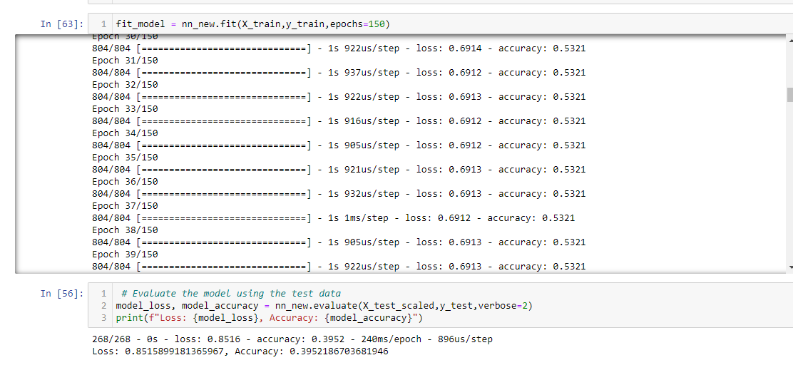
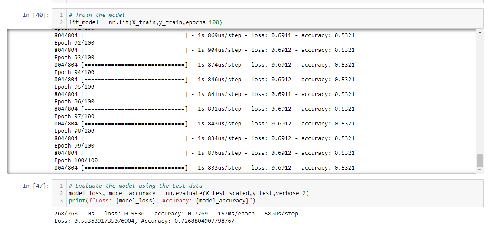

# Charity-Machine-Learning

using a machine learning algorithm, we were tasked with find if the applicants will be successful if funded by alphabet soup

## Results

the following variables and features are those that were considered:

- APPLICATION_TYPE
- AFFILIATION
- CLASSIFICATION
- USE_CASE
- ORGANIZATION
- STATUS
- INCOME_AMT
- SPECIAL_CONSIDERATIONS
- ASK_AMT
- IS_SUCCESSFUL

the ones left out were : 

- NAME
- EIN

the target variable was 

- IS_SUCCESSFUL

# layers of modeling

i gradually increased the layers and the amount of neurons in them. furthermore i increased the epochs hoping that the more the machine tested the data, the more accurcate it would become.

# Summary

While i was never able to reach the 75% accuracy i believe that being 2% off is roughly close enough that with the modeling used we can say that the likelyhood of people using the funding will sucseed. However to be more confident I recommend that we use a different type of modeling or look over the data again to and re-ampent the anaylsis.
